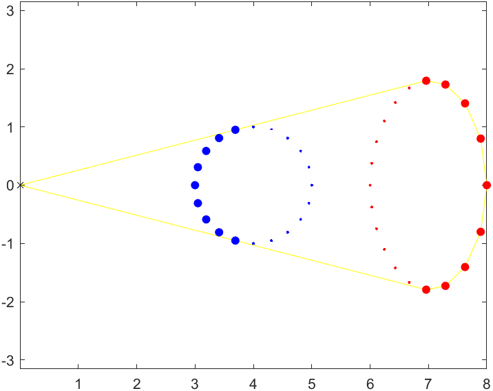
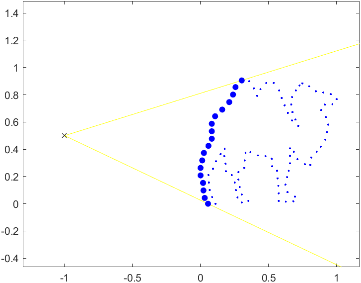
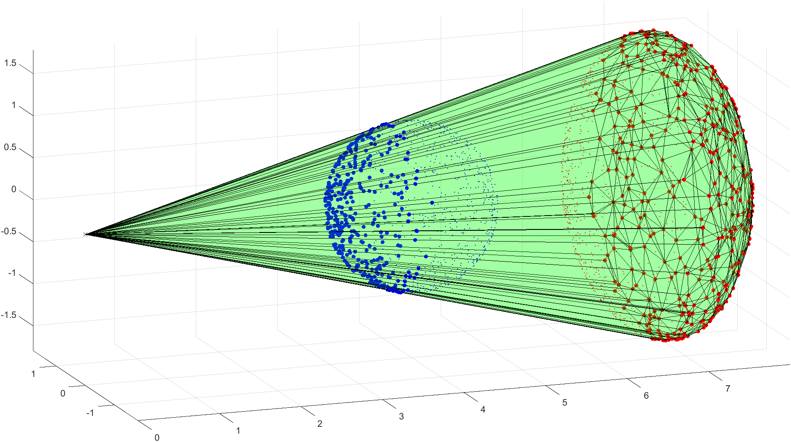
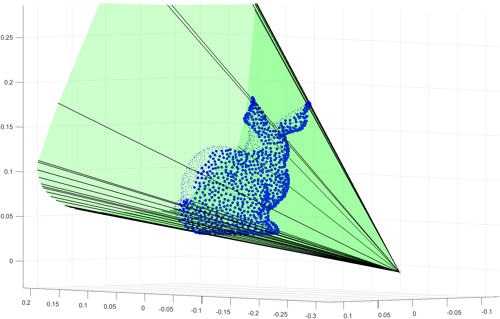

# Point Set Visibility

Implemented the direct visibility of point sets algorithm in Matlab for both 2D and 3D point sets, as described in this [paper]( https://www.weizmann.ac.il/math/ronen/sites/math.ronen/files/uploads/katz_tal_basri_-_direct_visibility_of_point_sets.pdf).

